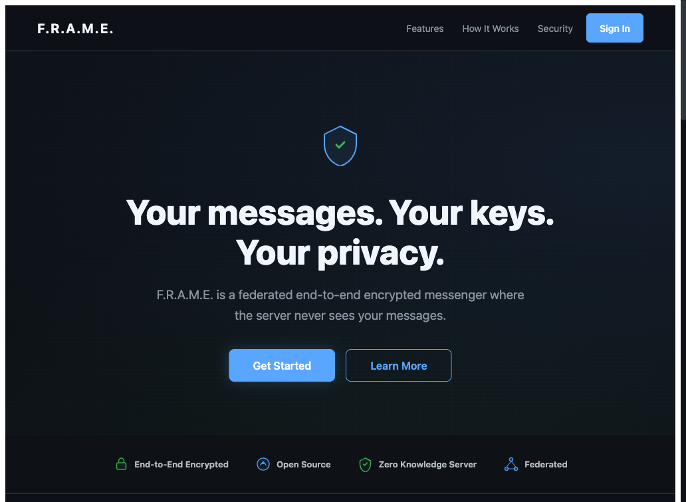
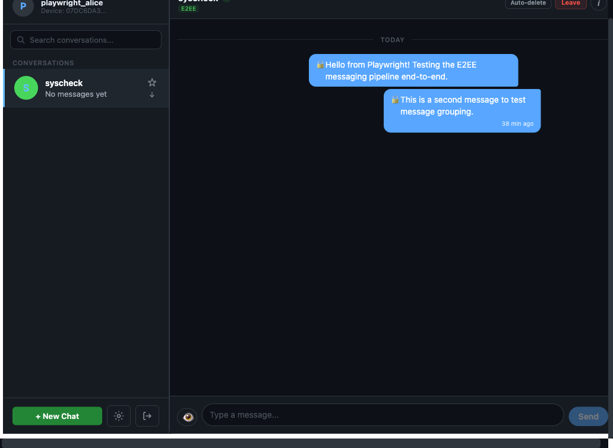
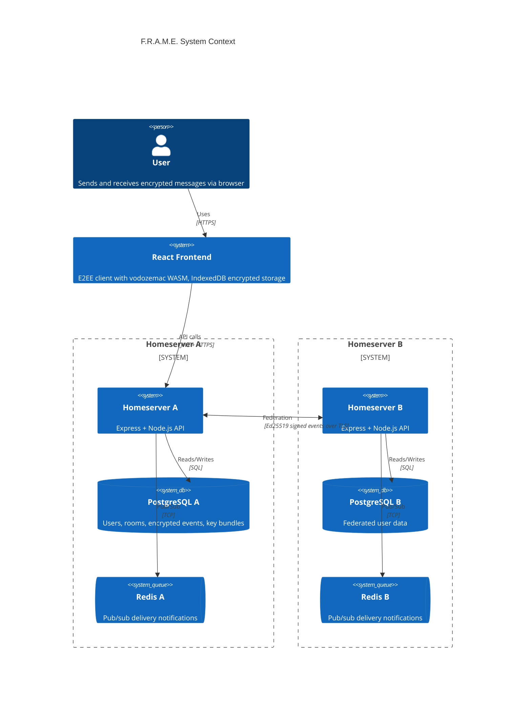
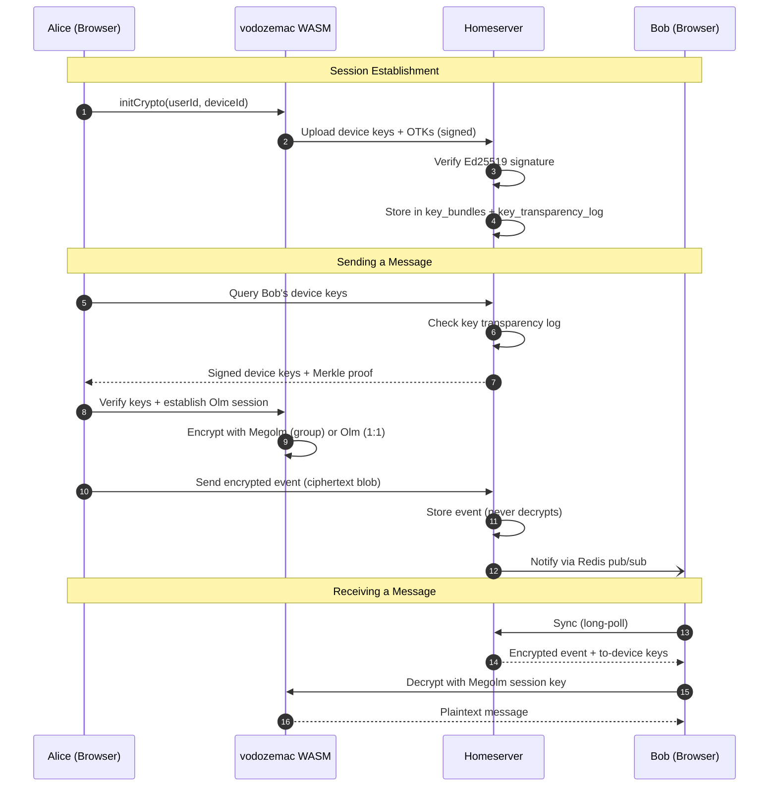
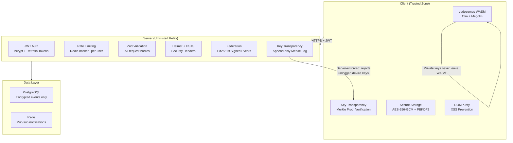
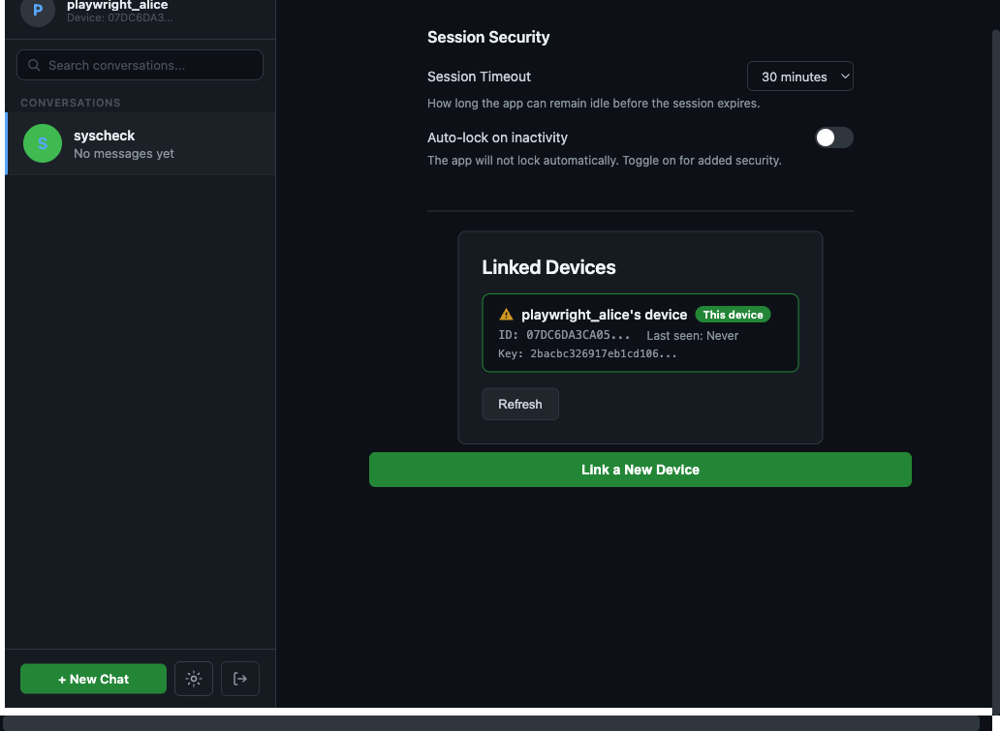
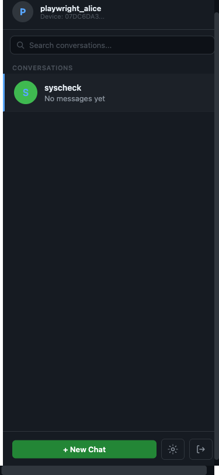

# Project F.R.A.M.E.

**Federated Ratcheting Architecture for Messaging Encryption**

[]()
[]()
[]()
[]()
[]()
[]()

---

<p align="center">
  
</p>

<p align="center">
  
</p>

---

## What is F.R.A.M.E.?

F.R.A.M.E. is a federated, end-to-end encrypted messaging platform built as a security-focused course project. It implements the Double Ratchet protocol (via vodozemac/Olm) for one-to-one messaging and Megolm for group chats, ensuring that homeservers act purely as untrusted relays -- they transport encrypted blobs without ever reading message content.

The system is designed around a zero-trust server model: all cryptographic operations happen exclusively on the client. Key generation, encryption, decryption, and identity verification run in the browser using vodozemac compiled to WebAssembly. The backend stores encrypted payloads, manages user accounts and device registries, and coordinates cross-server delivery through a federation protocol inspired by the Matrix specification.

F.R.A.M.E. also implements a Merkle Tree-based key transparency system, allowing clients to cryptographically verify that the server has not silently substituted public keys. Combined with per-device key bundles, multi-device fan-out, and signed device keys with Ed25519 signature verification, the platform provides a comprehensive demonstration of modern messaging security principles.

---

## Key Features

- **End-to-End Encryption** -- Double Ratchet (Olm) for 1:1 chats, Megolm for group sessions, powered by audited vodozemac WASM
- **Federation** -- Multiple homeservers relay encrypted events to each other with signed federation protocol and peer authentication
- **Key Transparency** -- Merkle Tree append-only log with cryptographic proofs clients can independently verify
- **Multi-Device Support** -- Per-device key bundles, encrypted fan-out to all devices, device heartbeat tracking
- **Zero-Trust Server** -- Homeservers never decrypt content; all crypto runs client-side via Web Crypto API and vodozemac
- **Real-Time Sync** -- Long-polling message sync with Redis pub/sub notifications for instant delivery
- **Room Management** -- Direct messages, group chats, room invites, password-protected rooms, disappearing messages
- **Secure Storage** -- IndexedDB with at-rest encryption for local key material and session state
- **Push Notifications** -- VAPID-based Web Push with opaque payloads (no message content in notifications)
- **Security Hardened** -- Helmet CSP headers, rate limiting per endpoint type, Zod request validation, Ed25519 signature verification on key uploads

---

## Architecture Overview



Both homeservers run identical code -- differentiated entirely by environment variables. The frontend is the only trusted component; it performs all encryption and decryption.

### E2EE Message Flow



### Security Architecture



---

## Quick Start

### 1. Clone the repository

```bash
git clone https://github.com/Dev-Ahmad-Abdallah/project-F.R.A.M.E.git
cd project-F.R.A.M.E
```

### 2. Install dependencies

```bash
npm install
```

This installs all three workspaces: `shared`, `services/homeserver`, and `services/frontend`.

### 3. Start Docker services

```bash
docker-compose up -d
```

This starts 2 PostgreSQL instances, 2 Redis instances, 2 homeservers, and the frontend.

### 4. Run database migrations

```bash
cd services/homeserver && npm run migrate
```

### 5. Start development servers

```bash
# From the project root:
npm run dev:homeserver   # Backend on http://localhost:3000
npm run dev:frontend     # Frontend on http://localhost:5173
```

Or use Docker for everything: the compose file runs homeserver-a on port 3000, homeserver-b on port 3001, and frontend on port 3002.

---

## Tech Stack

| Layer | Technology | Purpose |
|-------|-----------|---------|
| **Frontend** | React 19, TypeScript 5.4 | UI framework with type-safe components |
| **E2EE Engine** | vodozemac via `matrix-sdk-crypto-wasm` 18.x | Olm/Megolm encryption (Rust compiled to WASM) |
| **XSS Prevention** | DOMPurify 3.x | Sanitize all rendered message content |
| **Local Storage** | IndexedDB via `idb` 8.x | Encrypted at-rest storage for keys and sessions |
| **Backend** | Node.js 20, Express 4.x | HTTP API server with middleware pipeline |
| **Database** | PostgreSQL 16.3 | Users, devices, rooms, events, key bundles, transparency log |
| **Cache/Queue** | Redis 7.2 | Pub/sub delivery notifications, session temp state |
| **Auth** | JWT (HS256) + bcrypt | Short-lived access tokens (15m) + refresh tokens (7d) |
| **Validation** | Zod 3.x | Runtime request validation on all backend endpoints |
| **Security Headers** | Helmet 8.x | CSP, HSTS, X-Frame-Options, and 10 other headers |
| **Containerization** | Docker + Docker Compose | Multi-service local dev and production deployment |
| **Deployment** | Railway | PaaS with auto-TLS, health monitoring, rollback |

---

## Project Structure

```
project-F.R.A.M.E/
├── package.json                # Root workspace config (npm workspaces)
├── docker-compose.yml          # Full local stack: 2 homeservers, 2 PG, 2 Redis, frontend
├── scripts/                    # Dev pipeline, test runner, watch scripts
├── shared/                     # @frame/shared -- TypeScript interfaces (no runtime code)
│   └── types/                  # api.ts, events.ts, keys.ts, devices.ts, federation.ts
├── services/
│   ├── homeserver/             # @frame/homeserver -- Backend API
│   │   ├── src/
│   │   │   ├── server.ts       # Express app entry + graceful shutdown
│   │   │   ├── config.ts       # Zod-validated env var parsing
│   │   │   ├── routes/         # auth, keys, messages, devices, rooms, federation, push, health
│   │   │   ├── middleware/     # JWT auth, rate limiting, CORS, validation, error handling
│   │   │   ├── services/       # Business logic (auth, keys, messages, devices, federation, Merkle)
│   │   │   ├── db/             # PostgreSQL pool + parameterized SQL queries
│   │   │   └── redis/          # ioredis client + pub/sub subscriber
│   │   ├── migrations/         # 10 SQL migration files (001-010)
│   │   └── tests/              # Jest unit and integration tests
│   └── frontend/               # @frame/frontend -- React client app
│       └── src/
│           ├── crypto/         # vodozemac OlmMachine, key manager, session manager
│           ├── api/            # Fetch wrappers with JWT auth
│           ├── storage/        # IndexedDB encrypted storage
│           ├── verification/   # Key transparency, fingerprint UI
│           ├── devices/        # Device manager, linking, alerts
│           └── components/     # ChatWindow, AuthFlow, DeviceList, settings
└── docs/                       # Architecture docs, ADRs, security models
```

---

## Screenshots

| Landing Page | Chat Interface |
|:---:|:---:|
|  |  |

| Settings | Mobile View |
|:---:|:---:|
|  |  |

---

## Security Model

| Layer | Control | Implementation |
|-------|---------|---------------|
| **Encryption** | Double Ratchet (Olm) + Megolm | vodozemac WASM -- private keys never leave browser |
| **Key Transparency** | Server-enforced Merkle tree | Device keys rejected if not in append-only log |
| **Key Signatures** | Ed25519 device key verification | Server verifies self-signatures on key upload |
| **Forward Secrecy** | Megolm session rotation | New session created when members leave a room |
| **Authentication** | JWT + bcrypt (12 rounds) | 15-min access tokens, 7-day refresh with rotation |
| **Rate Limiting** | Redis-backed per-user limits | Per-room message limits, dedicated sync/key limiters |
| **Input Validation** | Zod schemas on all endpoints | Request body/query validated before processing |
| **XSS Prevention** | DOMPurify strict allowlist | Script, iframe, form tags blocked; href-only attributes |
| **Headers** | Helmet + HSTS | CSP, X-Frame-Options: DENY, no-sniff, referrer policy |
| **Session Security** | 30-min inactivity timeout | Auto-lock with server-side token revocation |
| **Device Management** | 10-device limit, QR linking | Cascading delete, verification badges, deep-link QR |
| **Federation** | Ed25519 signed events | Signature verification, replay prevention, room membership check |
| **CI/CD Security** | CodeQL + Trivy + gitleaks | SAST, container scanning, secret detection, npm audit |

---

## API Endpoints (51 total)

| Category | Count | Examples |
|----------|-------|---------|
| Auth | 9 | register, login, logout, refresh, profile, status |
| Keys | 7 | upload, query, claim, count, revoke, transparency |
| Messages | 9 | send, sync, delete, react, read receipts, typing |
| Rooms | 12 | create, join, invite, leave, rename, settings, codes |
| Devices | 4 | register, list, delete, heartbeat |
| Federation | 4 | send, keys, backfill, directory |
| Push | 3 | VAPID key, subscribe, unsubscribe |
| Infrastructure | 3 | health, root info, .well-known |

All endpoints use `requireAuth` (except public/federation), rate limiting, and `asyncHandler` for error propagation.

---

## Team

| Name | Role | Responsibilities |
|------|------|-----------------|
| **Ahmed Ali Abdallah** (234742) | Backend & Database Security | Homeserver API, PostgreSQL schema, federation protocol, key distribution, Merkle tree |
| **Mohamed Hussain** (235697) | Frontend & API Security | React client, vodozemac integration, E2EE implementation, secure storage, XSS prevention |
| **Hossam** | DevOps & Deployment Security | Docker, CI/CD, Railway deployment, TLS, monitoring, secrets management |

---

## Documentation

| Document | Description |
|----------|-------------|
| [API Reference](docs/API.md) | Complete REST API documentation with curl examples |
| [Setup Requirements](docs/setup-requirements.md) | Prerequisites, env vars, first-time setup checklist |
| [Architecture Decisions (Phase 2)](docs/architecture-decisions-phase2.md) | Key technical decisions and rationale |
| [Architecture Critique](docs/architecture-critique.md) | Devil's advocate security analysis |
| [Project Structure](docs/project-structure.md) | Detailed directory layout and Railway service mapping |
| [Backend Overview](docs/backend/overview.md) | Server architecture, database schema, component breakdown |
| [Frontend Overview](docs/frontend/overview.md) | Client architecture, data flow, crypto engine design |
| [Contributing](CONTRIBUTING.md) | Development workflow, code style, PR process |

---

## License

This project is developed as a course project for Computer System Security. MIT License.
